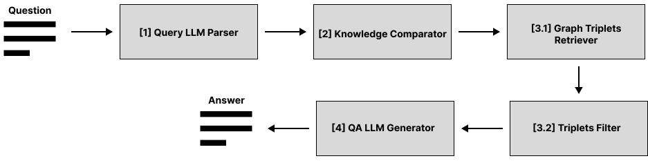

Высокоуровневая архитектура
===========================

QA-конвейер
-----------

Общий конвейер по извлечению релевантной информации из графа знаний для генерации ответов на вопросы представлен на Рисунке 1.

Из Рисунка 1 видно, что конвейер разбит на четыре стадии, при этом третья стадия состоит из двух этапов. На вход конвейеру поступает пользовательский вопрос в строковом формате, который передаётся в модуль "Query LLM Parser". В данном модуле выполняется извлечение ключевых сущностей из вопроса. На второй стадии полученная информация передаётся в модуль "Knowledge Comparator" , где выполняется сопоставление (matching) сущностей из вопроса с объектами из графа знаний. На третей стадии  выполняется поиск и фильтрация триплетов из графа знаний, релевантных вопросу, в рамках первого и второго этапов соответственно. На первом этапе с помощью модуля “Graph Triplets Retriever” выполняется запуск одного из реализованных алгоритмов обхода графа: в качестве стартовых выступают те вершины, которые были сопоставлены сущностям из вопроса в рамках второй стадии конвейера. В результате будет извлечён список потенциально-релевантных триплетов. На втором этапе с помощью модуля “Triplets Filter” выполняется ранжирование триплетов по степени их семантической близости к вопросу. В результате работы третей стадии будет получен список из N (гиперпараметр) триплетов, ближайших (семантически) к данному вопросу. На последней четвёртой стадии с помощью модуля "QA LLM Generator" выполняется генерация ответа на вопрос, обусловленная извлечённой информацией. Полученный ответ в строковом формате возвращается как результат работы конвейера.
Данная архитектура конвейера мотивирована следующими соображениями:
* Для получения хорошего начального приближения к подграфу с требуемой информацией необходимо сопоставить ключевые объекты из вопроса с похожими объектами из имеющегося набора знаний.
* Информация, которая требуется для генерации правильного ответа содержится в том же подграфе, что и ключевые сущности из вопроса.
* Извлечённые из графа знаний триплеты слабо обусловлены исходным вопросом. При этом каждый триплет имеет свою степень важной информации, которая требуется для генерации правильного ответа. Также у больших языковых моделей есть ограничение по максимальной длине текстовой последовательности, которую можно подать на вход.

Далее в подразделах представлено более подробное описание модулей, используемых в рамках данного конвейера.

1 Разбор вопроса
^^^^^^^^^^^^^^^^

На данной стадии выполняется обращение к большой языковой модели для извлечения сущностей из вопроса в авторегрессионном режиме. Модель на вход получает сам текстовый вопрос и prompt-подсказку, в котором описана задача и формат генерации результата: данный prompt представлен в Приложении А.

2 Сопоставление вопроса со знаниями в графе
^^^^^^^^^^^^^^^^^^^^^^^^^^^^^^^^^^^^^^^^^^^

Для сопоставления вершин графа знаний с сущностями вопроса выполняется их перевод из текста в пространство эмбеддингов: к полученным векторам дополнительно применяется оператор нормировки. Для каждой сущности с помощью алгоритма приближенного поиска извлекается M (гиперпараметр) самых ближайших вершин по “1 - dot-product”-метрике [1, 2]. Полученные вершины сохраняются в единый список без информации об отношении к сущностям. В качестве embedder-модели используется E5-small из HuggingFace-репозитория [3].

3 Алгоритмы поиска информации в графе
^^^^^^^^^^^^^^^^^^^^^^^^^^^^^^^^^^^^^

3.1 А*-алгоритм
^^^^^^^^^^^^^^^

В качестве одного из алгоритмов обхода графа знаний для извлечения релевантных триплетов был реализован A*-алгоритм [4]. В рамках алгоритма выполняется поиск кратчайших путей между всеми парами вершин, сопоставленных сущностям на второй стадии QA-конвейера. В результате такого обхода все триплеты, попавшие в кратчайшие пути сохраняются в единый список с удалением дубликатов (по их содержанию). При использовании данного алгоритма выдвигается следующая гипотеза: информация, которая требуется для генерации правильного ответа содержится в триплетах из кратчайших путей между сущностями исходного вопроса. Во время обхода граф считается невзвешенным и неориентированным. В качестве d-метрики расстояния между смежными вершинами используется константное значение. В качестве эвристической h-метрики расстояния между текущей и конечной вершиной было реализовано три варианта:
* “ip” - dot-product расстояние эмбеддингов между текущей и конечной вершиами.
* “weight_with_short_path” - длина кратчайшего пути, полученного с помощью bfs-алгоритма, умноженная на “ip”-метрику.
* “avg_weighted_with_short_path” - усреднённое значение ip-расстояний ембеддингов смежных вершин в пути от начальной до текущей и  ip-расстояния между текущей и конечной вершинами, умноженное на длину кратчайшего пути, полученного с помощью bfs-алгоритма, между текущей и конечной вершинами.

В качестве модели для получения векторных представлений текста используется E5-small из HugingFace-репозитория [1].

3.2 Алгоритм поиска в ширину
^^^^^^^^^^^^^^^^^^^^^^^^^^^^

TODO

3.3 Комбинированный алгоритм
^^^^^^^^^^^^^^^^^^^^^^^^^^^^

TODO

4 Генерация ответа на вопрос
^^^^^^^^^^^^^^^^^^^^^^^^^^^^

На данной стадии выполняется обращение к большой языковой модели для генерации ответа на вопрос в авторегрессионном режиме. Модель на вход получает сам текстовый вопрос, список извлечённых триплетов c третьей стадии, приведённых в строковый формат, и prompt-подсказку, в котором описана задача и формат генерации результата: данный prompt представлен в Приложении Б.

Memorize-конвейер
-----------------

TODO

Список литературы
-----------------

TODO
