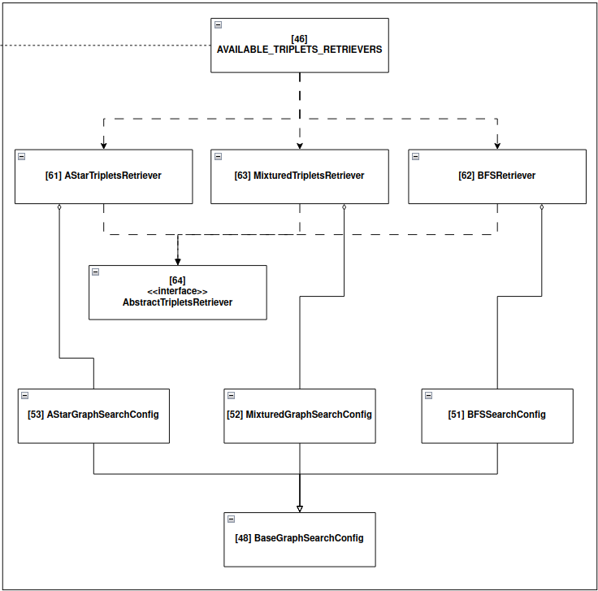

Available Triplets Retrievers
=============================

src.qa\_pipeline.knowledge\_retriever package
---------------------------------------------

Submodules
^^^^^^^^^^

src.qa\_pipeline.knowledge\_retriever.AStarTripletsRetriever module
^^^^^^^^^^^^^^^^^^^^^^^^^^^^^^^^^^^^^^^^^^^^^^^^^^^^^^^^^^^^^^^^^^^

.. automodule:: src.qa_pipeline.knowledge_retriever.AStarTripletsRetriever
   :members:
   :undoc-members:
   :show-inheritance:
   :no-index:

src.qa\_pipeline.knowledge\_retriever.BFSTripletsRetriever module
^^^^^^^^^^^^^^^^^^^^^^^^^^^^^^^^^^^^^^^^^^^^^^^^^^^^^^^^^^^^^^^^^

.. automodule:: src.qa_pipeline.knowledge_retriever.BFSTripletsRetriever
   :members:
   :undoc-members:
   :show-inheritance:
   :no-index:

src.qa\_pipeline.knowledge\_retriever.MixturedTripletsRetriever module
^^^^^^^^^^^^^^^^^^^^^^^^^^^^^^^^^^^^^^^^^^^^^^^^^^^^^^^^^^^^^^^^^^^^^^

.. automodule:: src.qa_pipeline.knowledge_retriever.MixturedTripletsRetriever
   :members:
   :undoc-members:
   :show-inheritance:
   :no-index:
